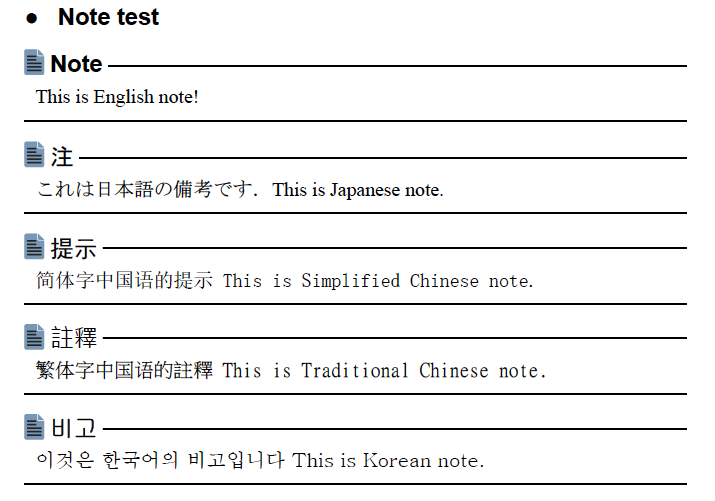

# Antenna House PDF5-<i>ML</i> Plugin
PDF5-ML is the [DITA Open Toolkit] [3] PDF plug-in for actual business usage. It was derived from [PDF5] [7] plugin and radically refined from the beginning.

## FEATURES
 - Supports multiple language formatting in one DITA document
 - Realize conditional variable & style definition
 - Enables free format cover pages
 - Free paper size definition & selection

## Multiple language formatting
----------
PDF5-ML supports xml:lang in any level elements of a topic.

```xml
<section>
    <title>Ph test</title>
    <p>We say "Hello" in English.</p>
    <p>We say "<ph xml:lang="ja-JP">こんにちは！</ph>" in Japanese.</p>
    <p>We say "<ph xml:lang="zh-CN">你好！</ph>" in Chinese.</p>
    <p>We say "<ph xml:lang="ko-KR">안녕하세요！</ph>" in Korean.</p>
</section>
```
This example is formatted as follows. The font is automatically assigned by @xml:lang value such as "MS Mincho" for Japanese, "SimSun" for Simplified Chinese, "Batang" for Korean.


```xml
<section>
    <title>Note test</title>
    <note type="note" xml:lang="en">This is English note!</note>
    <note type="note" xml:lang="ja-JP">これは日本語の備考です．This is Japanese note.</note>
    <note type="note" xml:lang="zh-CN">简体字中国语的提示 This is Simplified Chinese note.</note>
    <note type="note" xml:lang="zh-TW">繁体字中国语的註釋 This is Traditional Chinese note.</note>
    <note type="note" xml:lang="ko-KR">이것은 한국어의 비고입니다 This is Korean note.</note>
</section>
```
This note sample is formatted as follows provided that bookmap/@xml:lang is "en-US".



The title of note for each language is selected automatically by xml:lang value. The stylesheet does not concern this selection. All of the settings are defined in external style definition files.


If you build this data by DITA-OT PDF2 plug-in, you will get the following result:


## Conditional variable & style definition

This plug-in doesn't use `xsl:attribute-set` without limited exception. Most of the styles are written in the external XML file called "Style Definition File".

```xml
<!-- Sample of external Style Definition File -->
<!-- Fonts -->
<variable name="General_Serif_Font">serif</variable>
<variable name="General_Sans_Serif_Font">sans-serif</variable>
<variable name="General_Monospace_Font">monospace</variable>

<variable name="General_Text_Font">$General_Serif_Font</variable>
<variable name="General_Title_Font">$General_Sans_Serif_Font</variable>

<!-- define title style -->
<attribute-set name="atsTitle">
    <attribute name="font-family">$General_Title_Font</attribute>
</attribute-set>

<!-- define bold style -->
<attribute-set name="atsB">
    <attribute name="font-weight">bold</attribute>
</attribute-set>

<!-- define indentation by variable -->
<variable name="Toc_Indent_Size">7mm</variable>

<!-- define TOC line style with referencing variable -->
<attribute-set name="atsTocLevel1" use-attribute-sets="atsB">
    <attribute name="font-family">$General_Text_Font</attribute>
    <attribute name="font-size">11.5pt</attribute>
    <attribute name="text-align">justify</attribute>
    <attribute name="text-align-last">justify</attribute>
    <attribute name="text-indent">-1 * $Toc_Indent_Size</attribute>
    <attribute name="start-indent">inherited-property-value(start-indent) + $Toc_Indent_Size</attribute>
    <attribute name="space-before">3mm</attribute>
</attribute-set>

<attribute-set name="atsTocLevel2">
    <attribute name="font-family">$General_Text_Font</attribute>
    <attribute name="font-weight">normal</attribute>
    <attribute name="font-size">11pt</attribute>
    <attribute name="text-align">justify</attribute>
    <attribute name="text-align-last">justify</attribute>
    <attribute name="text-indent">-1 * $Toc_Indent_Size</attribute>
    <attribute name="start-indent">inherited-property-value(start-indent) + ($Toc_Indent_Size * 2)</attribute>
    <attribute name="space-before">2mm</attribute>
</attribute-set>
```
As shown above, `xsl:variable` like notation is supported using another namespace. An variable can be referenced by adding "$" to its name and it can be used in an attribute definition. This function is simpler than standard XSLT notation and makes it a great flexibility to define the structured style.


### Conditional variable

There are predefined attributes for writing conditional variable or attribute-set.

- @paper-size
- @doc-type
- @output-type

The following example shows the auto switching of images for default web based PDF, color print PDF and monochrome print PDF by using @output-type. The actual output-type will be supplied by `xsl:param` from the caller side.

```xml
<variable name="Note_Icon">url(%plug-in-path%common-graphic/note.svg)</variable>
<variable name="Note_Icon" output-type="print-color">url(%plug-in-path%common-graphic/note.pdf)</variable>
<variable name="Note_Icon" output-type="print-mono">url(%plug-in-path%common-graphic/note-mono.pdf)</variable>

<attribute-set name="atsNoteNoteIconImage">
    <attribute name="space-end">1mm</attribute>
    <attribute name="src">$Note_Icon</attribute>
    <attribute name="content-height">1.1em</attribute>
    <attribute name="baseline-shift">-0.5mm</attribute>
</attribute-set>
```
In this example "%plug-in-path%" notation is automatically replaced by the plug-in absolute path when it is used.

## Free format cover pages

For the most of DITA stylesheet programmers it is a headache problem to design the cover pages of the PDF publication. The component of a cover contains logo image, document title, web link, etc. They cannot be expressed by the flow object. Rather these components will be placed in  the absolute positioned object.

This plug-in enables to locate items in cover by specifying the following @outputclass notation in map:

```xml
<frontmatter>
  ...
  <topicref href="c_Cover1.dita" format="dita" outputclass="cover1"/>
  <topicref href="c_Cover2.dita" format="dita" outputclass="cover2"/>
  ...
</frontmatter>
```

If topicref/@outputclass is "coverN" format, this plugin generates fo:block-container from topic/body/bodydiv. Also using the fo:prop property introduced in [ah-dita] [8], you can make free format cover pages.


This function also brings a great benefit to the users. User can change  the cover design by themselves. They don't need stylesheet programmers to change their cover contents. The following is the snippet from cover authoring:

```xml
<conbodydiv
 fo:prop="position:absolute;top:40mm;right:10mm;width:40%;height:130mm;">
 <!--title-->
 <section>
  <p fo:prop="font-family:Franklin Gothic Demi Cond;font-size:24pt;line-height:120%;">Antenna House</p>
  <p fo:prop="font-family:Arial;font-weight:bold;font-size:32pt;line-height:120%;">PDF5-<i fo:prop="color:deeppink;">ML</i> plugin</p>
  <p fo:prop="font-weight:bold;font-size:28pt;line-height:120%;">User's Guide</p>
 </section>
</conbodydiv>
```

## Free paper size definition & selection

There are many user requests to select multiple paper sizes in one PDF plug-in. PDF5-ML enables free paper size definition and selection.

The following is the sample definition of paper size & crop size in the style definition file:

```xml
<!-- Supported paper specification
     Name,width,height,crop-width,crop-height
     crop size is temporary value.
     Based on http://en.wikipedia.org/wiki/Paper_size
 -->
<variable name="Paper_Info" delim="[,\s]+">
    Letter,215.9mm,279.4mm,10mm,10mm,
    Government-Letter,203.2mm,266.7mm,10mm,10mm,
    Legal,215.9mm,355.6mm,10mm,10mm,
    B6,125mm,176mm,10mm,10mm,
    B5,176mm,250mm,10mm,10mm,
    B4,250mm,353mm,10mm,10mm,
    A6,105mm,148mm,10mm,10mm,
    A5,148mm,210mm,10mm,10mm,
    A4,210mm,297mm,10mm,10mm </variable>
```

You can select any paper size by specifying ant parameter.

```
   ant -Dpaper.size=Letter
```

Paper size definition can be customized by yourself according to your output requirement.

## com.antennahouse.pdf5.ml folder

This folder contains PDF5-ML plug-in files and folders. To install this plug-in, refer to pdf5-ml_manual.pdf.

## jp.acme-corporation.pdf.ml folder

This folder contains sample plug-in that overrides PDF5-ML plug-in for your own customization.

## samples folder

This folder contains the sample DITA instance and formatted results.

|Folder|Contents|
|---|---|
|sample_en|This folder contains DITA elements and attribute test data. It also demonstrates index page generation.|
|sample_ja|Contains Japanese index page example.|
|sample_cover|Contains the example of cover page generation and three output-type (web, print-color and print-mono). This sample data needs DITA 1.3 RELAX NG schema and [ah-dita] [8] specialization to get the output.|
|sample_udhr|Contains multi-language DITA instance example.|
|sample_dita13|Contains DITA 1.3 example.|

## oxygen-integrarion folder

This folder contains the HTML file that describes how to integrate PDF-ML with oXygen XML Editor.


## Copyright
Copyright (C) 2009-2016 Antenna House, Inc. All rights reserved.  
Antenna House is a trademark of [Antenna House, Inc.] [2]

This plug-in uses graphics from www.vectorbackground.net under the Creative Commons Attribution license.

This plug-in uses graphics from pixabay.com under the Creative Commons CC0.

## License

This software is licensed under the [Apache License, Version 2.0] [1].

[1]: http://www.apache.org/licenses/LICENSE-2.0 "Apache License, Version 2.0"
[2]: http://www.antennahouse.com/ "Antenna House, Inc."
[3]: http://sourceforge.net/projects/dita-ot/ "DITA Open Toolkit"
[4]: http://antennahouse.com/product.htm "Antenna House Formatter"
[5]: https://www.oasis-open.org/committees/tc_home.php?wg_abbrev=dita "OASIS Darwin Information Typing Architecture (DITA)"
[6]: http://www.w3.org/TR/xsl/ "XSL Formatting Object"
[7]: https://github.com/AntennaHouse/pdf5
[8]: https://github.com/AntennaHouse/ah-dita
